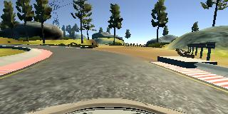
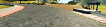
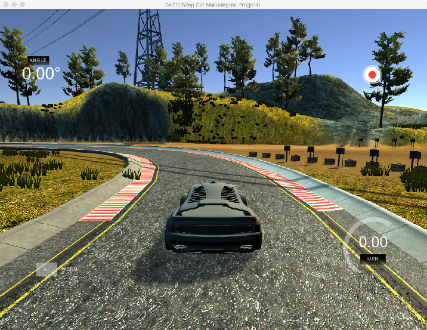
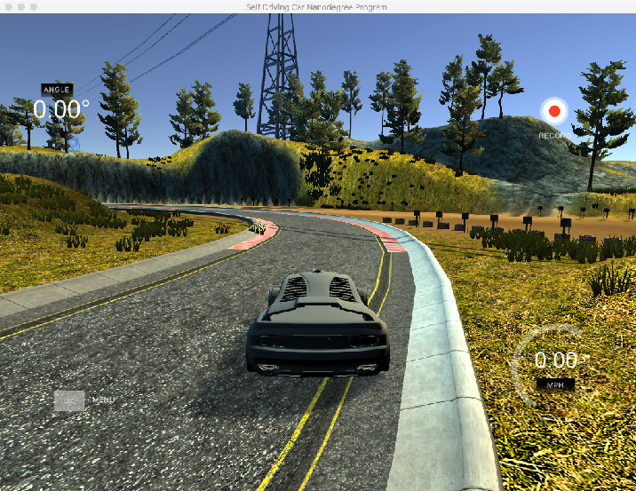

#Behavioral Cloning Assignment

## Introduction

The behavioral cloning assignment consists of creating a neural network that takes as an input images taken from a car's dashboard, pointing at the road, and outputs the corresponding steering angle to stay on the road.

Udacity provides a simulator that can be used to record data and also drive a car in autonomous mode in a virtual environment. The simulation takes place in a track, similar to a racing track.

## Download simulator

* [Linux](https://d17h27t6h515a5.cloudfront.net/topher/2017/February/58ae46bb_linux-sim/linux-sim.zip)
* [MacOS](https://d17h27t6h515a5.cloudfront.net/topher/2017/February/58ae4594_mac-sim.app/mac-sim.app.zip)
* [Windows](https://d17h27t6h515a5.cloudfront.net/topher/2017/February/58ae4419_windows-sim/windows-sim.zip)

[Source code](https://github.com/udacity/self-driving-car-sim)

## How to execute code

* First train the neural network `train.py datat`
* Start the simulator in autonomous mode and run the driving code `drive.py data/outputs/model.json`

## Result video
[Youtube](https://www.youtube.com/watch?v=So5oz6gRuYQ)

##Architecture

The neural network architecture used for this project is has 5 layers and can be trained on cpu.

* Layer 1: 5x5 convolution, output 24 filters
* Layer 2: 3x3 convolution, output 36 filters
* Layer 3: flatten fully connected
* Layer 4: 50 neurons fully connected
* Layer 5: 10 neuros fully connected

### Input
The images generated by Udacity's simulator are 160x320. In order to train the neural network on cpu and have a quick turn around, I had to make some drastic decisions to reduce the number of pixels to process. I played with two things: cropping useless piece of the image and then downsample the image.

The top area of 52 pixels, above the horizon, is cropped out. The bottom area of 25 pixels, the car's hood is cropped out too. Then the image is downsampled by 3x.

The input is an image in rgb format of size 106x27. The neural network applies a normalization for each channel before the first convolutional layer.

|||
|----------|--------|
|Original|Neural network input|

### Output
The original architecture returns 1/r where r is the steering angle. Instead, I decided to keep it simple and output the steering angle straight.

### Techniques to prevent overfitting
To prevent overfitting two approaches have been implemented: dropouts and real-time data augmentation. 

Dropouts have been added to the two first fully connected layers. It forces the neural network to rely on more than one feature to predict the output.

Real-time data augmentation, by always presenting different images to the network, allows the network to generalize features quicker and makes the network insensible to minor image change. Images are randomly shifted, verticaly and horizontaly. The shift is a slight shift of a tiny amount, 5%, such that the steering angle can be kept unchanged.

##Collecting data
Udacity's simulator has been used to record images and corresponding steering angles. Two laps of normal driving and the two laps of going back to center have been recorder (see pictures). The last step is the most important part of the training. It teaches the neural network how to go recover when the car is sidetracked.

##Training

The data set is split in training and validation set. 20% of the original data set is reserved for the validation. Each image from the training set is duplicated by adding an horizontal mirror image and an opposite steering angle. Doing so, prevents the neural network being bias towards left or right turns, as our data set has an uneven set of turns.

The neural network is trained over 10 epochs and quickly converges to a steering angle prediction good enough to finish one lap of Udacity's simulator in autonomous mode.
